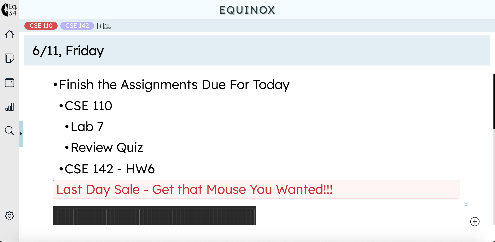

# Equinox - CSE 110 Group 34 Project
### Organize Your Life Through Bullet Journaling!

## Onboarding 

Check out our [**Onboarding Document**](./specs/onboard.md) to get started with the Project.  
  
Check out our [**Feature List**](./specs/features/feature-list.md) to get acquainted with the different features of the product.

Check out our [**Options List**](./specs/features/options.md) to know of the different options for the different features allowed in our project.

## Our Project

Check out our [**Team Page**](./admin/team.md) for more information about the developers of Equinox!

👨‍💻 Equinox aims to make the process of Bullet Journaling simpler. 

👨‍💻 We, as developers, strive for stepping into the users' shoes to develop an extremely intuitive design for anyone using Equinox.

👨‍💻 Equinox serves as the Group 34's Project for CSE 110: Software Engineering.

