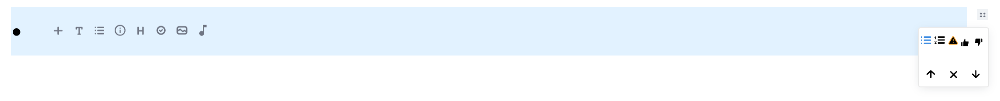
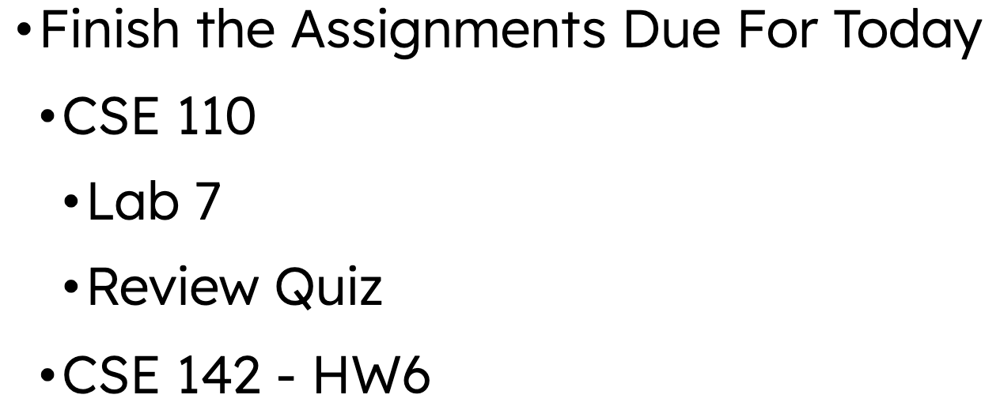
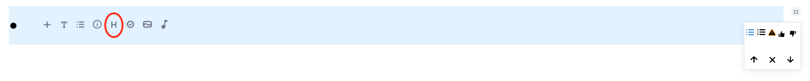
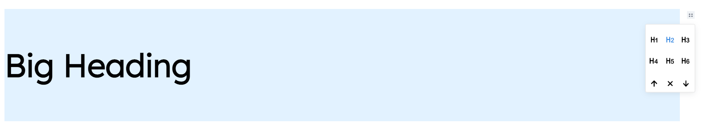

# Feature List

## A List of All The Features Currently Implemented

<ins>Quick Note:</ins> Click outside of the current element to move on to create a new element. Clicking on `ENTER/RETURN` would help create a newline/bullet on the same element. 
  
To change an option for a given feature, click on the four dots on the top right of an element which will appear once you hover near it.

### 1. Rapid Logging - Nested Bullets

You can quickly take notes in bullet-format and this is the default option presented when you enter the website.  
Click on `TAB` to nest a list by one level and click on `ENTER/RETURN` to de-nest a list by one level.

  
### 2. Expandable Calendar

We have a vertical calendar that can be expanded and minimized at will for better usability. Thanks to Professor Powell for giving us this suggestion. This has been animated for aesthetic purposes.
  
The year can be changed by clicking on the two arrows beside the year currently selected. The month can be selected by clicking on the dropdown that has the currently selected month.  

### 3. Headings

There are 6 different heading sizes that can be added from `h1` through to `h6`. Click on the `H` option. 

### 4. Checklists

Click on the `Tick` option. These types of bullets can be selected or deselected.

### 5. Alerts

Click on the `(i)` option. These type of bullets have their own background that can be customized with the following colors/

### 6. Bold/Italics/Highlight/Link

Text can be bolded, italicized, highlighted by selecting the text that you want to do the prior operation to. You can also add a link by doing the same.

### 7. Different Bullet Styles

There are multiple bullet styles to choose from and can be chosen from the button with the four dots on the top left.

# INSERT GIF HERE

### 8. Image

You can either upload an image from your computer or copy paste a link to add an image. Click on the `Image` Button to upload from your local computer.

### 9. Audio

You can either upload an image from your computer or copy paste a link to add an image. Click on the `Audio` Button to upload from your local computer.

### 10. Webcam

You can also take pictures using your webcam and accept/delete them at will. Once you accept, it is turned into a picture and is added to the journal.  
  
Click on the `Plus` button in the right-bottom corner of the page where you can find a `Camera` Icon, which upon clicking will display your webcam capture. You can also switch between available cameras by clicking on the `Switch` button to the right of `Capture`.

### 11. Voice Memo

You can record voice memos using your microphone and add them to your journal. It is rendered as an audio file in the journal.

Click on the `Plus` button in the right-bottom corner of the page where you can find a `Microphone` Icon, which upon clicking will display your a 'Record' button. Record at your will and it will show a timer. Upon completion of the record, this will be automatically rendered as an audio file in the journal.

### 12. YouTube

You can copy-paste a YouTube link for it to be rendered as a YouTube Video Embed in the Journal and can be watched from the Journal itself. 

### 13. Drag Elements using Button on Top Right

Elements can be dragged across the page by dragging the button with the four dots on the top right of an element. This enables easy reorganization of elements in the journal.

### 14. Move Elements using Options from Button on Top Right

For people not comfortable with dragging elements, top and down buttons inside the same button on the top right can allow elements to move up and down respectively by one element with one click of the button.

### 15. Ability to Delete using Backspace

Any element can be easily deleted using `Backspace`. This enables easy deletion of the elements. An alternative way to delete elements is to use the `X` Button under the button on the top right. 

### 16. Copy-Paste by Highlighting Elements

### 17. Different Languages

### 18. Labels

### 19. Reload goes back to Today's Date and Automatically Scrolls to that Date 

### 20. Animations

## Features That Were Planned But Did Not Implement

There were many features that we wanted to originally implement but due to time constraints and the relative difficulty of the tasks we were not able to:

### 1. Different Languages for Labels

### 2. Search Function

### 3. Indexing through Date

### 4. About Page

### 5. Calendar Page

### 6. Summary of Labels

