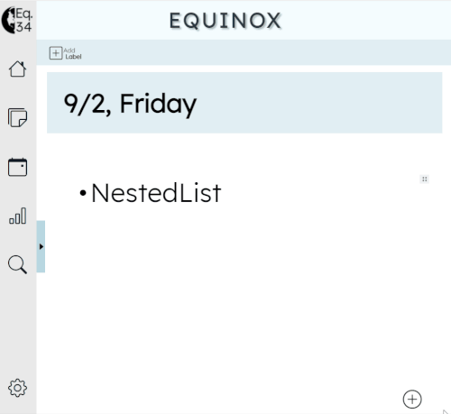
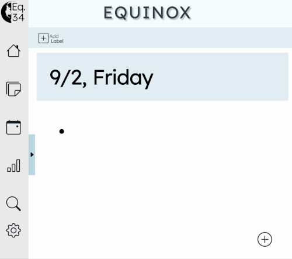
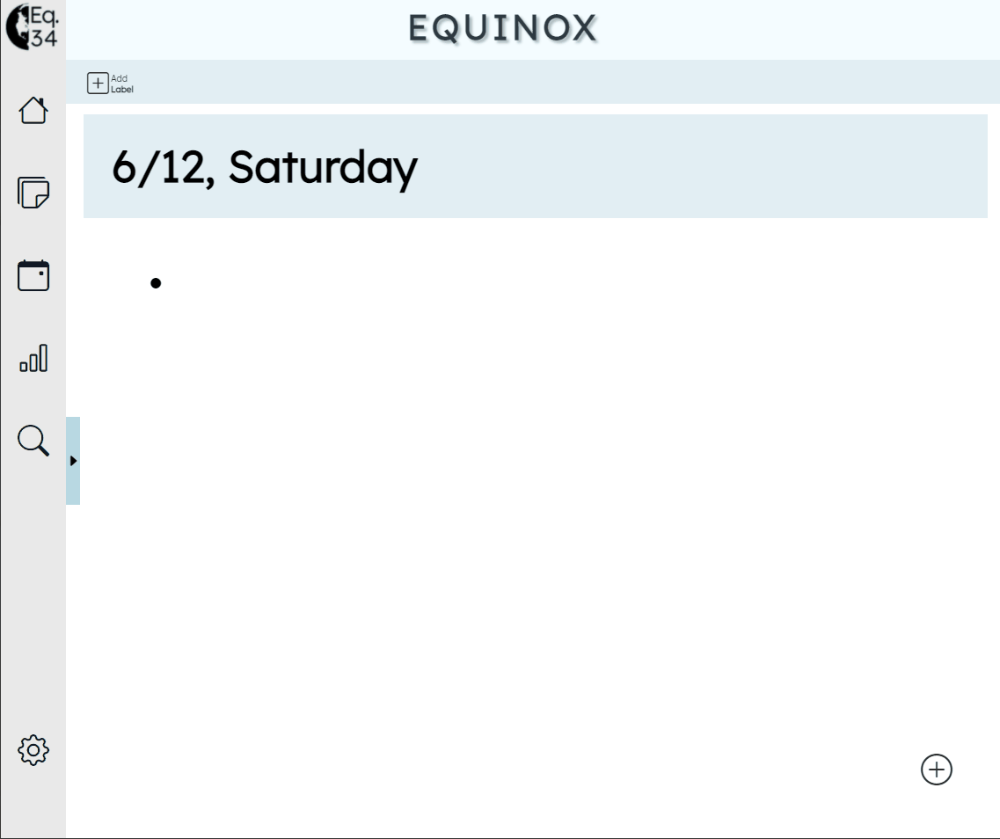
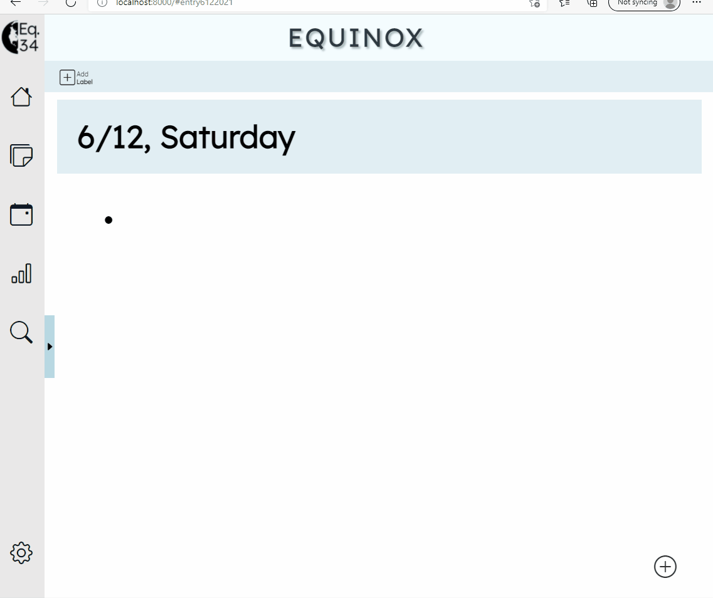

# Feature List

## A List of All The Features Currently Implemented

<ins>Quick Note:</ins> Click outside of the current element to move on to create a new element. Clicking on `ENTER/RETURN` would help create a newline/bullet on the same element. 
  
To change an option for a given feature, click on the four dots on the top right of an element which will appear once you hover near it.  

### 1. Rapid Logging - Nested Bullets

You can quickly take notes in bullet-format and this is the default option presented when you enter the website.  
Click on `TAB` to nest a list by one level and click on `ENTER/RETURN` to de-nest a list by one level.  
  

  
### 2. Expandable Calendar

We have a vertical calendar that can be expanded and minimized at will for better usability. Thanks to Professor Powell for giving us this suggestion. This has been animated for aesthetic purposes.  
  
The year can be changed by clicking on the two arrows beside the year currently selected. The month can be selected by clicking on the dropdown that has the currently selected month.  
  

### 3. Headings

There are 6 different heading sizes that can be added from `h1` through to `h6`. Click on the `H` option. 
  

  

### 4. Checklists

Click on the `Tick` option. These types of bullets can be selected or deselected.  
  
 

### 5. Alerts

Click on the `(i)` option. These type of bullets have their own background that can be customized with the following colors.  
  

### 6. Bold/Italics/Highlight/Link

Text can be bolded, italicized, highlighted by selecting the text that you want to do the prior operation to. You can also add a link by doing the same.  
  

### 7. Different Bullet Styles

There are multiple bullet styles to choose from and can be chosen from the button with the four dots on the top left.  
  

### 8. Image

You can either upload an image from your computer or copy paste a link to add an image. Click on the `Image` Button to upload from your local computer.  
  

### 9. Audio

You can either upload an image from your computer or copy paste a link to add an image. Click on the `Audio` Button to upload from your local computer.   

### 10. Webcam

You can also take pictures using your webcam and accept/delete them at will. Once you accept, it is turned into a picture and is added to the journal.    
  
Click on the `Plus` button in the right-bottom corner of the page where you can find a `Camera` Icon, which upon clicking will display your webcam capture. You can also switch between available cameras by clicking on the `Switch` button to the right of `Capture`.  

### 11. Voice Memo

You can record voice memos using your microphone and add them to your journal. It is rendered as an audio file in the journal.  

Click on the `Plus` button in the right-bottom corner of the page where you can find a `Microphone` Icon, which upon clicking will display your a 'Record' button. Record at your will and it will show a timer. Upon completion of the record, this will be automatically rendered as an audio file in the journal.  

### 12. YouTube

You can copy-paste a YouTube link for it to be rendered as a YouTube Video Embed in the Journal and can be watched from the Journal itself.   

### 13. Drag Elements using Button on Top Right

Elements can be dragged across the page by dragging the button with the four dots on the top right of an element. This enables easy reorganization of elements in the journal.  

### 14. Move Elements using Options from Button on Top Right

For people not comfortable with dragging elements, top and down buttons inside the same button on the top right can allow elements to move up and down respectively by one element with one click of the button.  

### 15. Ability to Delete using Backspace

Any element can be easily deleted using `Backspace`. This enables easy deletion of the elements. An alternative way to delete elements is to use the `X` Button under the button on the top right.   

### 16. Copy-Paste by Highlighting Elements

Elements can be copy-pasted between dates or within the same date by just highlighting over those elements and using the appropriate copy/cut and paste command.  

### 17. Different Languages

We have implemented the functionality for the different languages:
1. English
2. Chinese
3. Bahasa Indonesia
4. Arabic
5. Tamil

The different languages are implemented in hopes of accomodating people who speak these other languages and feel more comfortable with them. This was suggested by Professor Powell as a meaningful way to showcase our diverse cultural backgrounds.  
  

### 18. Labels
Labels are implemented for each date so that one could go to a date and quickly know an overview of their tasks. It allows for easy compartmentalization and organization of tasks along with rapid checking of the overview for different dates.

### 19. Reload goes back to Today's Date and Automatically Scrolls to that Date 

As bullet journals as mostly used to log activities for days around the current date, we thought going to the current date would be the most sensible load for the first time entering the page. Even if you have lost yourself to a different date, you can quickly reload to come back to the today's date.

### 20. Animations

Animations are added to make every change in state look cleaner in terms of UX and aesthetics. This allows for a more pleasant experience with the app and makes it feel alive rather than a rigid outdated web app.

## Features That Were Planned But Did Not Implement

There were many features that we wanted to originally implement but due to time constraints and the relative difficulty of the tasks we were not able to:

### 1. Different Languages for Labels

We really wanted to complete the functionality for changing the languages of the prompts displayed when creating or editing the label. This would allow for the complete experience of using a different language in Equinox. But, as implementation of labels was completed on Wednesday of Week 11, we were not able to figure out how to access storage for the language and hence missed out on this small feature. 

### 2. Search Function

A function to search for the bullets to correctly know which date a certain bullet is coming from was planned.

### 3. Indexing through Date

The functionality to type in a date and quickly go to that date without navigating the vertical calendar was also proposed.

### 4. About Page

A short About Page that gave a quick tutorial of the features in Equinox was also proposed but we did not get the time to complete this one either.

### 5. Calendar Page

A conventional calendar that showed the labels of a page and which allowed the clicking of a date to load the editor up for that date was also proposed. 

### 6. Summary of Labels

A summary page that showed details about the different labels used by the user was also planned. This would maximise the potential that our labels implementation that we have right now.

### 7. Dark Mode

A Dark Mode was also planned but this turned out to be a mammoth task for the UI Designers, so we dropped it focus on a cleaner UI for the page we already have.

